# 🇵🇰 SarkariPortal — Pakistan's #1 Government Services Guide

> Pakistan's most complete online directory for government services — all in one place, completely free.

---

## 📌 About The Project

**SarkariPortal.pk** is a free, independent information website for Pakistani citizens. It brings together 50+ government services — NADRA, BISP, FBR, utility bills, passport services, health cards, jobs, tests, currency rates, gold prices, and more — all in one easy-to-use website.

Built because finding the right government website, understanding the process, and completing a task online is unnecessarily difficult for ordinary Pakistanis. SarkariPortal solves this with simple, clear, step-by-step guides.

> ⚠️ **Note:** SarkariPortal.pk is an independent information website. We are NOT affiliated with or endorsed by any government department of Pakistan.

---

## 🔗 Live Site

> 🚧 Currently in local development — coming soon online

---

## 📸 Screenshots

### 🏠 Homepage — All Pakistan Government Services in One Place
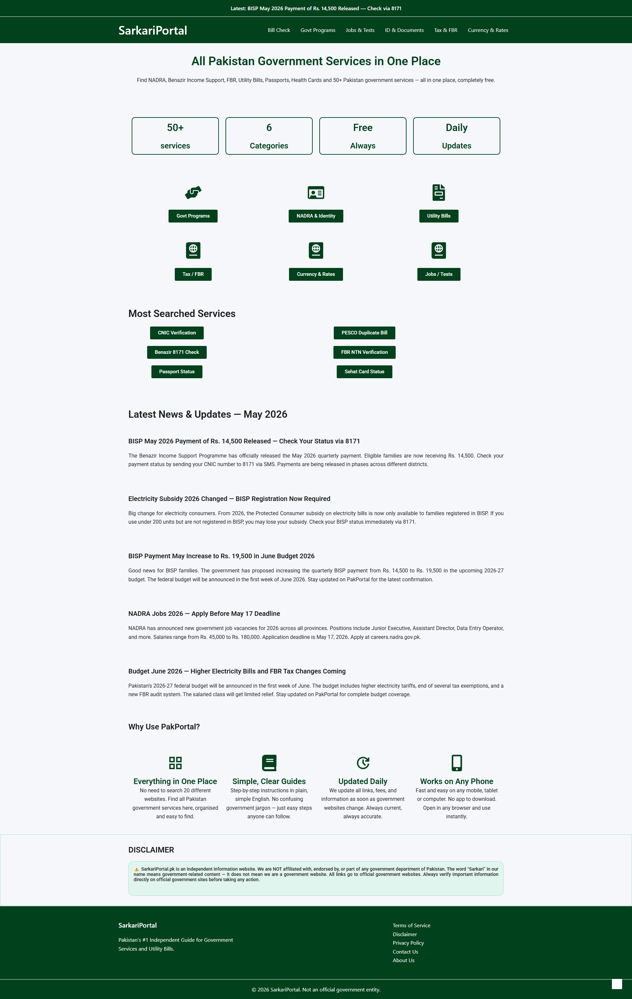

### 🧾 Bill Check — Electricity, Gas, Water & Telephone Bills
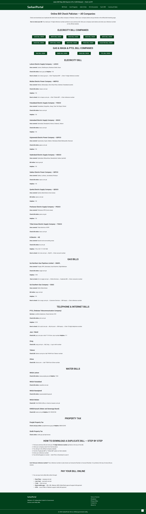

### 🏛️ Government Programs — BISP, Ehsaas, Punjab & KPK Schemes
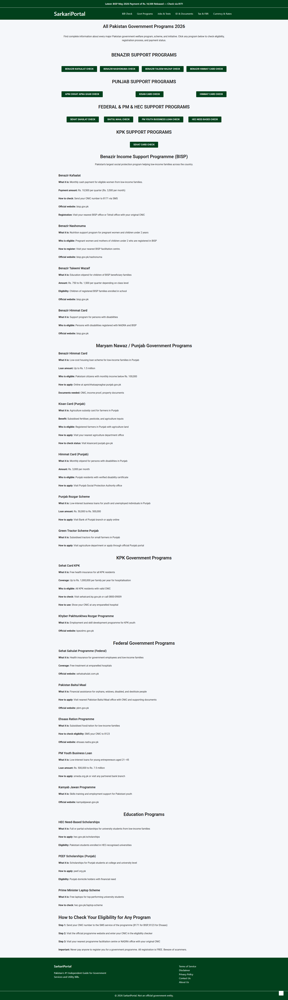

### 💼 Jobs & Tests — FPSC, NTS, PPSC, Army, Police & More
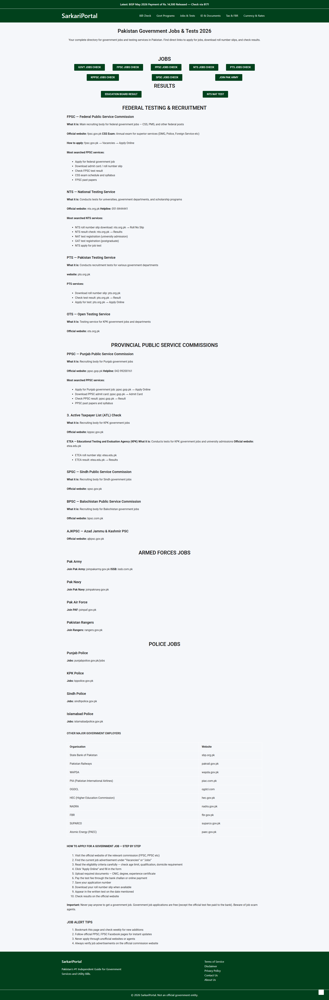

### 🪪 ID & Documents — NADRA, CNIC, Passport, B-Form & More
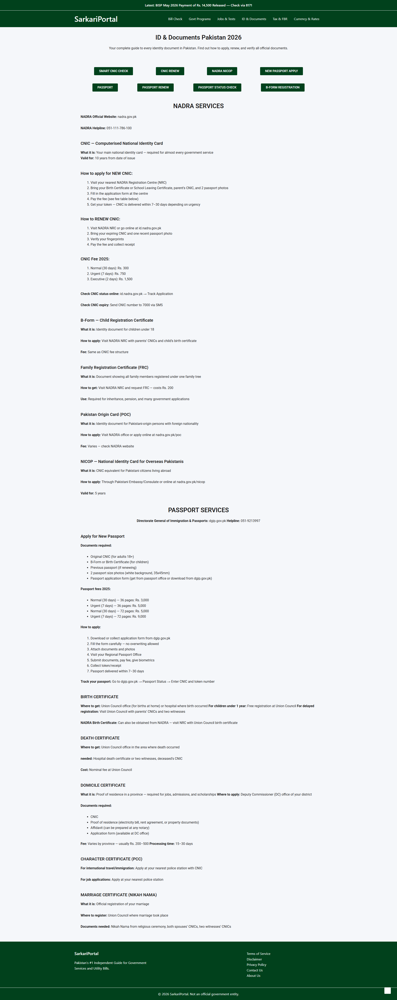

### 🏦 Tax & FBR — NTN, Tax Return, ATL & FBR Services
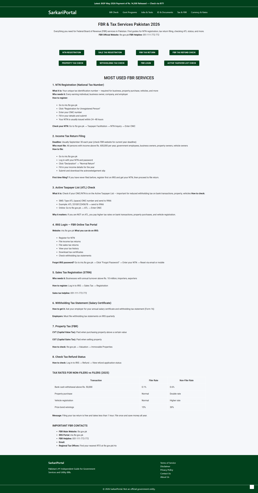

### 💰 Currency & Rates — USD, SAR, AED, Gold & Silver Prices
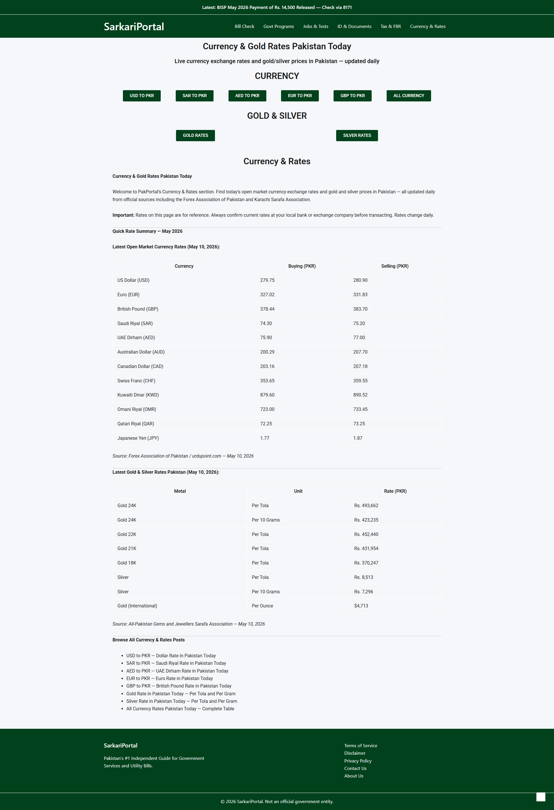

### 📋 Terms of Service
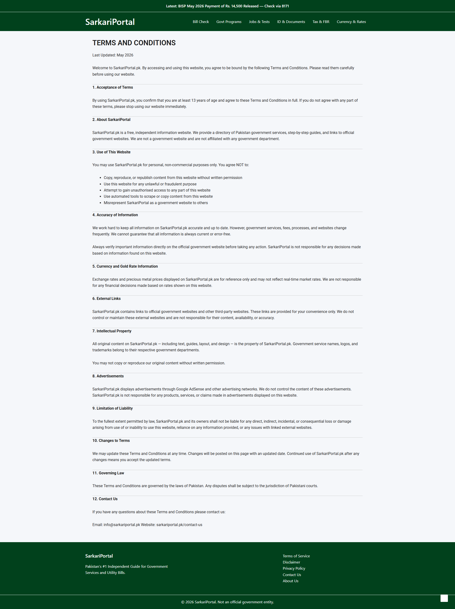

### 🔒 Privacy Policy
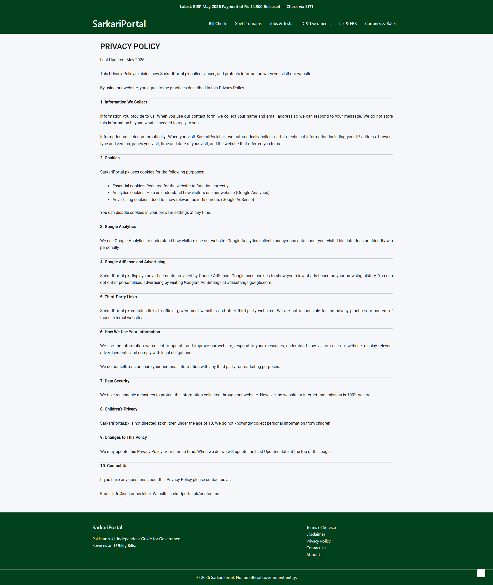

### ⚠️ Disclaimer
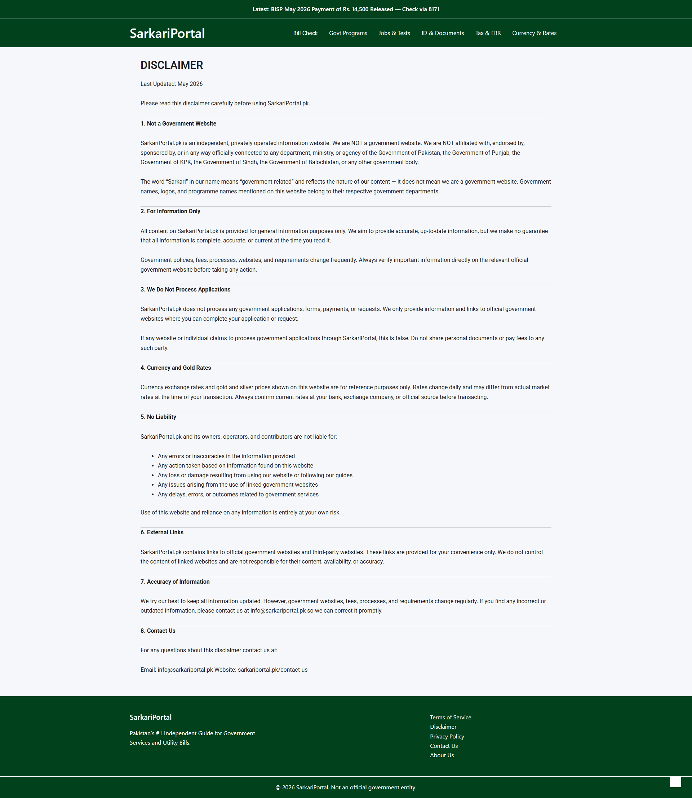

### 📞 Contact Us
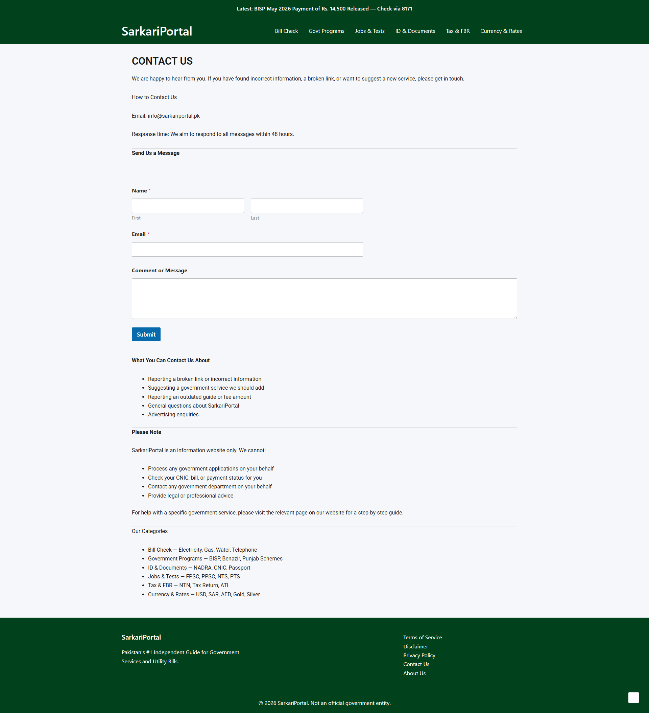

### ℹ️ About Us
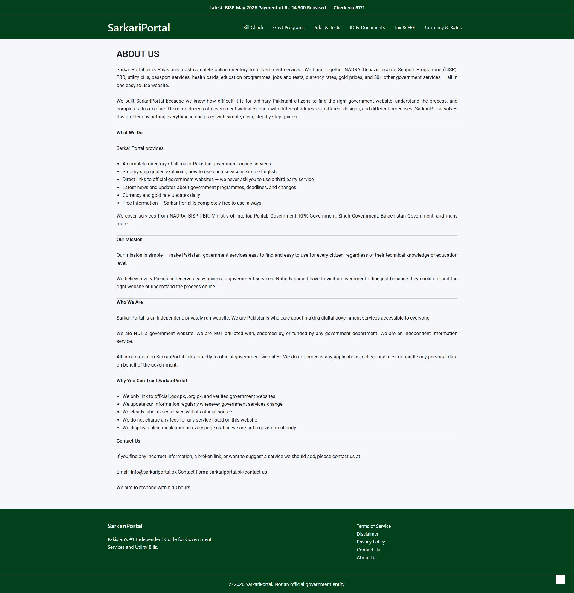

---

## ✅ Website Pages & Features

| Page | Description |
|---|---|
| 🏠 Homepage | 50+ services, latest news & updates, most searched services |
| 🧾 Bill Check | LESCO, MEPCO, FESCO, IESCO, SNGPL, PTCL, WASA & all companies |
| 🏛️ Govt Programs | BISP, Benazir Nashonuma, Ehsaas, Punjab & KPK schemes |
| 💼 Jobs & Tests | FPSC, NTS, PTS, PPSC, SPSC, Army, Navy, PAF, Rangers, Police |
| 🪪 ID & Documents | CNIC, B-Form, Passport, NICOP, FRC, Domicile, Character Certificate |
| 🏦 Tax & FBR | NTN Registration, Tax Return, ATL Check, IRIS Login, Property Tax |
| 💰 Currency & Rates | USD, SAR, AED, EUR, GBP, Gold 24K/22K/21K, Silver rates |
| 📋 Terms of Service | Full legal terms for website use |
| 🔒 Privacy Policy | Data collection, cookies & AdSense policy |
| ⚠️ Disclaimer | Independent website disclaimer, not a govt entity |
| 📞 Contact Us | Contact form + email for queries and suggestions |
| ℹ️ About Us | Mission, what we do, why trust SarkariPortal |

---

## 🛠️ Built With

- **WordPress** — CMS platform
- **Astra Theme** — Fast, lightweight base theme
- **Elementor** — Page builder for all layouts
- **Contact Form 7** — Contact page form
- **Yoast SEO / RankMath** — SEO optimization
- **WP Super Cache** — Speed optimization
- **Classic Editor** — Content management

---

## ⚡ Key Highlights

- 🇵🇰 50+ Pakistan government services covered
- 📱 Fully mobile responsive on all devices
- ⚡ Fast loading & SEO friendly
- 🆓 Completely free — no fees, no registration
- 🔄 Updated daily with latest news & rates
- 🔗 Links only to official `.gov.pk` & `.org.pk` websites
- 📰 Latest news section with BISP, budget & govt updates

---

## 👨‍💻 Developer

**Muhammad Shehzad** — WordPress Developer from Pakistan

---

⭐ If you find this project useful, please give it a star — it really helps!

